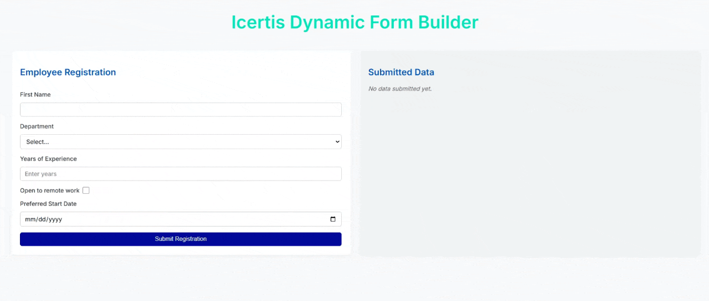

# Icertis Dynamic Form Builder

This project is a dynamic form builder application built with React, TypeScript,SCSS and Vite. It allows you to render forms from a JSON schema, validate user input, and display submitted data in real time.

## Features

- **Dynamic Form Rendering:** Renders forms based on a schema fetched from an API or defined locally.
- **Field Types Supported:** Text, Number, Checkbox, Select, Date.
- **Validation:** Supports required fields and custom validation rules.
- **Conditional Fields:** Show/hide fields based on other field values.
- **Live Submission Preview:** Displays submitted data in a summary card.
- **Modern UI:** Responsive and clean design using SCSS.

## Getting Started

### Prerequisites

- Node.js (v18 or above recommended)
- npm or yarn

### Installation

Clone the repository and install dependencies:

```bash
git clone https://github.com/KeshavDussal/icertis-dynamic-form.git
cd icertis-dynamic-form
npm install
# or
yarn install
```

### Running the App

Start the development server:

```bash
npm run dev
# or
yarn dev
```

Open [http://localhost:5173](http://localhost:5173) in your browser to view the app.

## Project Structure

- `src/`
  - `components/`
    - `FormRenderer.tsx` – Main form rendering logic
    - `Field.tsx` – Individual field rendering
  - `utils/` – Utility functions (validation, formatting)
  - `types.ts` – TypeScript type definitions
  - `App.tsx` – Main application component
  - `App.scss` – Styles

## Customizing the Form

The form schema is fetched from an API endpoint. You can update the schema or point to a different endpoint in `App.tsx`.

## License

MIT

## Demo

Here’s a quick preview of the form rendering:


